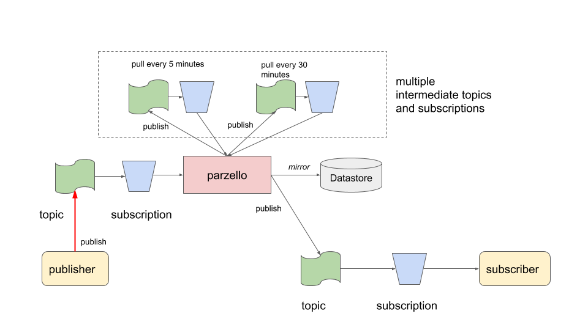
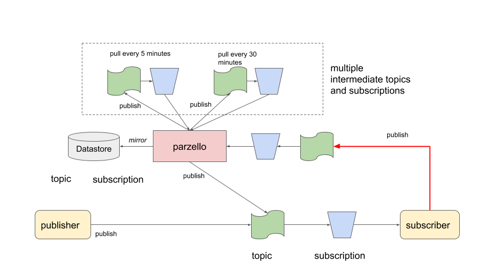

# parzello

Parzello is a delay service on top of Google Pub Sub to publish messages with a time delay to a topic.
It uses multiple intermediate topic->subscriptions to queue such messages which are pulled (streaming) on computed time intervals.
These intermediate resources (topics, subscription) need to be created before deploying this service with the corresponding configuration.

## use cases

Parzello was created to support a couple of unusual usecases.

### backoff or postpone processing

Consider the situation that the subscriber is unable to process a message because its backend services are not available.
Each such message can not be acknowledged.
Therefore it will be offered on the next pull (or push) causing many operation calls which cause increased network traffic.
One solution is to deliver those messages to `parzello` for the purpose of retrying it later.
Alternatively, the subscriber could be given the capability to stop|pause the pulling process.

### late night or bulk processing

Consider the requirement that messages need to be processed in a certain time window only (at night when more resources are available).
One solution is to deliver those messages to `parzello` for the purpose of having them published later.

### out of order

Pub Sub, like most message queueing solutions, does not guarantee that messages are delivered in the same order as they were published. This must be taken into account when designing the message definition and the subscriber software architecture. So rather then publishing events such as "order created", "order detail changed" one should have a single event "order updated" with all information about the order and the timestamp when it was updated.
If this design is not possible then the subscriber must handle the situation that an "order changed" event is received before an "order created" for the same entity.
One solution is to deliver those messages to `parzello` for the purpose of having them published again later.
Ofcourse this is a fragile design and can lead to problems (what if the created event was never published?) so be aware of this when using `parzello` for this case.

## how does it work?

Instead of the publisher publishing to its destination topic, it publishes the message to a `parzello` PubSub topic specifying the time to delay the publish using message properties (see details below).
The `parzello` service will publish that message to one of its intermediary topics. 
Each such topic has its own listener (pulling messaging) at a time interval.
Using a configuration, you must specify which intermediary topics you have created with durations based on your estimations of the actual delay amounts.

In this diagram, 2 such topics exists. One is pulled every 5 minutes. 
Each message is inspected, by looking at the message properties, to see whether it is about time to publish it to the actual destination topic.

For example, a message that needs to be delivered after 8 minutes will be published by `parzello` to `parzello_5_minutes` once and 3 times to `parzello_1_minute `.

In the next design, `parzello` is used to retry publishing a message at a later moment.
By passing publisch count metadata to the retry message, a subscriber can inspect this value and behave accordingly (i.e abort on MaxRetries).

## usage

### message attributes

#### properties when publishing to `parzello`

|name                       |required   |comment
|---------------------------|-----------|--------
|parzello.destinationTopic  |true       |topic to which the message eventually must be published
|parzello.publishAfter      |false      |Unix time (seconds after 1970) after which the message must be published

#### properties on a message received through `parzello`

|name                       |comment
|---------------------------|-------
|parzello.publishCount      |set to 1 if missing otherwise it is incremented when received by parzello
|parzello.originalMessageID |ID of message when it was rceived by parzello

### server config

The `parzello` server configuration (YAML) lists one or more queues (intermediate topic+subscriptions).
This example show 2 such queues. 
The topics and subscriptions must be created upfront in the project `YOUR-PROJECT-ID`.
A duration string is a possibly signed sequence of decimal numbers, each with optional fraction and a unit suffix, such as "60s", "1.5h" or "2h45m". Valid time units are "ms", "s", "m", "h".

    project-id: YOUR-PROJECT-ID
    subscription: parzello_inbound
    queues:
    - topic: parzello_minute
    subscription: parzello_minute
    duration: 1m
    - topic: parzello_five_minutes
    subscription: parzello_five_minutes
    duration: 5m

## build

    docker build -t parzello .

## run

    docker run -it \
        -v ~/.config/gcloud/:/gcloud \
        -e GOOGLE_APPLICATION_CREDENTIALS=/gcloud/application_default_credentials.json \
        parzello

## run development

    go run *.go -v
